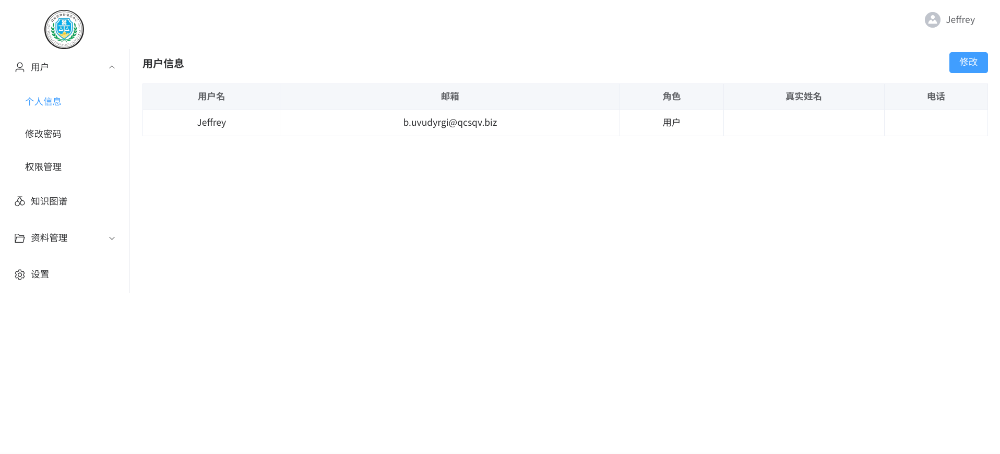
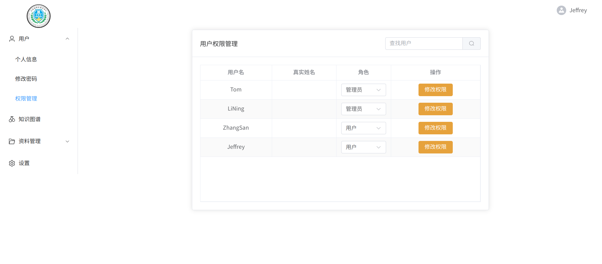
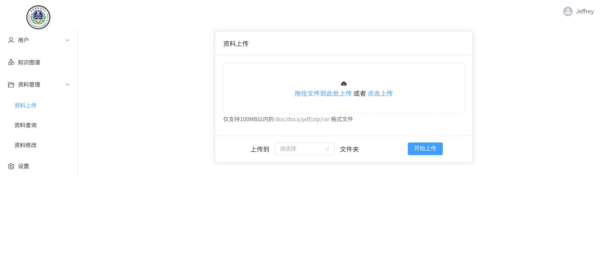
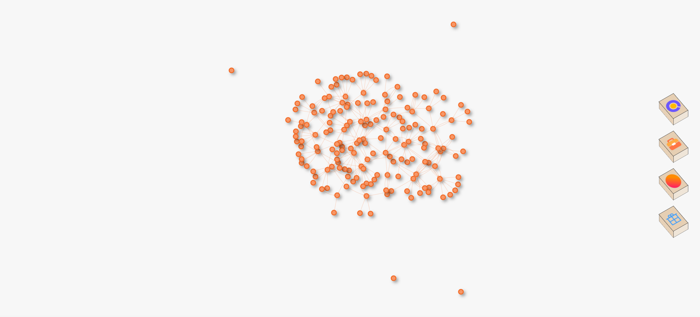

# Gec-Vue

燃气爆炸案件多模态知识图谱管理系统前端页面

## 技术栈

`TypeScript`+`Vue3.js`+`Pinia`+`Vue Router`+`Element Plus`+`axios`+`Neovis.js`+`Vite`

## 推荐 IDE 设置

[VSCode](https://code.visualstudio.com/) + [Volar](https://marketplace.visualstudio.com/items?itemName=Vue.volar) + [TypeScript Vue Plugin (Volar)](https://marketplace.visualstudio.com/items?itemName=Vue.vscode-typescript-vue-plugin).

## 页面展示

### 登录页面


### 用户信息页面



### 权限管理页面（仅管理员可见）



### 文件管理页面



### 知识图谱可视化页面



## 项目安装

```sh
npm install
```

### 开发

```sh
npm run dev
```

### 编译

```sh
npm run build
```
